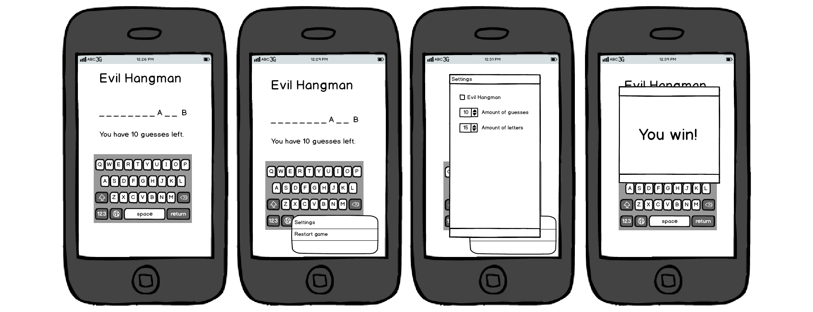
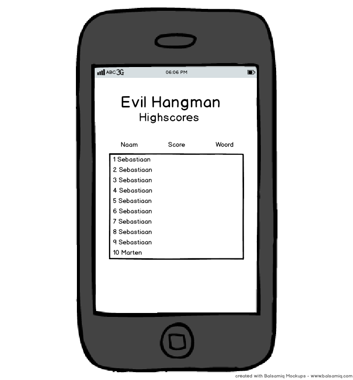

# Evil Hangman

An evil hangman game where the computer cheats.

# Features

* The user can play a game of (evil) hangman.
* The user can choose whether the game is evil or not.
* The user can pick the length of the word to be guessed.
* The user can set a maximum of incorrect guesses.
* The user can restart a game.
* The user can view his highscores.

# Tools

* Java
* Android
* Eclipse

# Mockups

